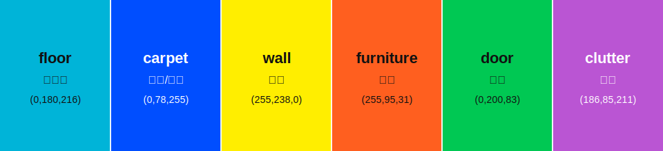

# Robot BEV 数据生成与转换使用说明

本文档说明如何从 Habitat-Sim/Replica 渲染标准 `robot_bev_dataset v3`
数据，转换成 BEVFusion 可读取的训练索引，并使用当前 RobotBEV 训练配置
打通训练链路。

整体流程如下：

```text
Habitat-Sim/Replica 渲染
  -> robot_bev_dataset v3 标准数据
  -> 严格校验与几何诊断
  -> BEVFusion infos 转换
  -> RobotBEVDataset 读取
  -> BEVFusion masked BEV segmentation 训练
```

## 代码位置

数据生成工具位于：

```text
data_generation/robot_bev/
```

常用入口：

```text
data_generation/robot_bev/cli/generate_replica.py
data_generation/robot_bev/cli/validate_dataset.py
tools/data_converter/robot_bev_converter.py
```

关键模块：

```text
data_generation/robot_bev/schema.py
data_generation/robot_bev/writer.py
data_generation/robot_bev/validator.py
data_generation/robot_bev/geometry_checks.py
data_generation/robot_bev/sources/habitat_common.py
data_generation/robot_bev/sources/replica.py
```

## 环境准备

数据渲染使用 `habitat022` 环境：

```bash
conda activate habitat022
cd /home/lihahaya/workspace/hikvision/bevfusion
export PYTHONPATH="$PWD:${PYTHONPATH:-}"
```

准备 Replica 数据集配置路径：

```bash
export REPLICA_CONFIG=/mnt/u/ubuntu/workspace/dataset/HIKVISION/replica/replica.scene_dataset_config.json
export OUTPUT_ROOT=/home/lihahaya/workspace/hikvision/bevfusion/data/replica_robot_bev_v3_repair
```

`REPLICA_CONFIG` 必须指向原始 Replica v1 PTex 的
`replica.scene_dataset_config.json`。生成器会检查 render mesh、PTex 贴图、
semantic mesh、`info_semantic.json`、navmesh 和 stage 配置。

## 生成 90 帧链路测试数据

这一步用于打通训练输入链路。它会渲染 9 个场景，每个场景 10 帧：
train 70 帧、val 10 帧、test 10 帧。

```bash
python -m data_generation.robot_bev.cli.generate_replica \
  --dataset "$REPLICA_CONFIG" \
  --dataset-id replica_robot_bev_v3 \
  --scenes hotel_0 office_0 office_1 office_2 office_3 office_4 room_0 room_1 room_2 \
  --split-file data_generation/robot_bev/configs/replica_splits.example.json \
  --output-dir "$OUTPUT_ROOT" \
  --num-frames 10 \
  --min-points 20 \
  --min-observed-coverage 0.01 \
  --max-quality-rejects 10000 \
  --gpu-id 0 \
  --disable-physics \
  --recompute-navmesh
```

当前本地 90 帧测试数据示例位置：

```text
data/replica_robot_bev_v3/
```

## 校验数据

先校验完整根目录，再分别校验 train、val、test。完整根目录校验用于确认
metadata、splits、scene summary 和 root index 一致；单独 split 校验用于确认
对应训练索引和样本内容可用。

```bash
python -m data_generation.robot_bev.cli.validate_dataset \
  --root "$OUTPUT_ROOT"

python -m data_generation.robot_bev.cli.validate_dataset \
  --root "$OUTPUT_ROOT" \
  --split train

python -m data_generation.robot_bev.cli.validate_dataset \
  --root "$OUTPUT_ROOT" \
  --split val

python -m data_generation.robot_bev.cli.validate_dataset \
  --root "$OUTPUT_ROOT" \
  --split test
```

校验成功时 JSON 输出中应包含：

```text
"valid": true
```

90 帧小数据中，val/test 可能出现某些类别计数为 0 的 warning。这类 warning
不等于格式错误，但训练前需要人工确认是否符合当前小样本的预期。

## 生成几何诊断图

建议每个 split 至少抽一个场景和帧做几何诊断：

```bash
python -m data_generation.robot_bev.cli.validate_dataset \
  --root "$OUTPUT_ROOT" \
  --split train \
  --geometry-scene office_0 \
  --geometry-frame 5

python -m data_generation.robot_bev.cli.validate_dataset \
  --root "$OUTPUT_ROOT" \
  --split val \
  --geometry-scene office_1 \
  --geometry-frame 5

python -m data_generation.robot_bev.cli.validate_dataset \
  --root "$OUTPUT_ROOT" \
  --split test \
  --geometry-scene office_4 \
  --geometry-frame 5
```

也可以一次生成同一场景的多帧诊断图：

```bash
python -m data_generation.robot_bev.cli.validate_dataset \
  --root "$OUTPUT_ROOT" \
  --split train \
  --geometry-scene office_0 \
  --geometry-frame-range 0 100 10
```

`--geometry-frame-range START STOP STEP` 使用 Python `range(START, STOP, STEP)`
语义；例如 `0 100 10` 会生成 `0, 10, 20, ..., 90`，不包含 `100`。

诊断图会写入：

```text
$OUTPUT_ROOT/diagnostics/<scene_id>/
```

重点看三类图：

```text
*_overview.png
*_rgb_point_overlay.png
*_bev_overlay.png
*_aligned_sweeps.png
```

`*_overview.png` 是单帧总览图，会拼接 RGB、深度伪彩、语义 ID 伪彩、
BEV label、observed mask 和 BEV+点云叠加图。其余三张分别用于检查相机
投影、BEV 方向和历史帧对齐。文件存在不代表几何正确，需要人工确认
x-forward/y-left、相机投影和 sweep 对齐是否符合预期。
其中 BEV label 类别颜色与 `tools/test.py`、`tools/visualize.py` 的
`map_pred/`、`map_gt/` 保持一致。

本地可直接打开 PNG：

```bash
xdg-open "$OUTPUT_ROOT/diagnostics/office_0/000000_overview.png"
```

无图形界面的远端服务器可以把 diagnostics 目录拷回本地查看，或者用 VS Code /
Cursor 的远程文件预览打开 PNG。

## 转换为 BEVFusion 训练索引

校验通过后，执行转换器：

```bash
python tools/data_converter/robot_bev_converter.py \
  --root "$OUTPUT_ROOT" \
  --split all \
  --max-sweeps 5
```

输出文件位于数据根目录：

```text
$OUTPUT_ROOT/bevfusion_infos_train.pkl
$OUTPUT_ROOT/bevfusion_infos_val.pkl
$OUTPUT_ROOT/bevfusion_infos_test.pkl
```

转换器不会复制图片、点云或 BEV mask，只会基于标准
`robot_infos_<split>.pkl` 生成 BEVFusion 风格索引。训练时仍然以
`$OUTPUT_ROOT` 作为数据根目录读取相对路径。

## 训练前数据目录应包含

转换完成后，训练输入数据根目录至少应包含：

```text
<root>/
  dataset_metadata.json
  splits.json
  multi_scene_summary.json
  robot_infos_train.pkl
  robot_infos_val.pkl
  robot_infos_test.pkl
  bevfusion_infos_train.pkl
  bevfusion_infos_val.pkl
  bevfusion_infos_test.pkl
  <scene_id>/
    images/
    points/
    bev_masks/
    bev_observed_masks/
    calib/
    poses/
    manifest.jsonl
    scene_infos.pkl
    robot_infos_<split>.pkl
```

其中训练监督相关字段包括：

```text
bev_mask_path
bev_observed_mask_path
class_validity
bev_supervision_mask_path  # 可选
```

有效训练 mask 规则是：

```text
observed_mask[None, :, :]
  * class_validity[:, None, None]
  * optional_per_class_supervision_mask
```

不要把未观测区域或 source 不支持的类别当成负样本。

## 远端 18 场景 x 600 帧生产数据

远端正式数据建议使用新空目录重新生成：

```bash
conda activate habitat022
cd /path/to/bevfusion
export PYTHONPATH="$PWD:${PYTHONPATH:-}"
export REPLICA_CONFIG=/path/to/replica/replica.scene_dataset_config.json
export PRODUCTION_ROOT=/path/to/output/replica_robot_bev_v3

python -m data_generation.robot_bev.cli.generate_replica \
  --dataset "$REPLICA_CONFIG" \
  --dataset-id replica_robot_bev_v3 \
  --scenes-file data_generation/robot_bev/configs/replica_scenes.txt \
  --split-file data_generation/robot_bev/configs/replica_splits.example.json \
  --output-dir "$PRODUCTION_ROOT" \
  --num-frames 600 \
  --min-points 20 \
  --min-observed-coverage 0.01 \
  --max-quality-rejects 10000 \
  --gpu-id 0 \
  --disable-physics \
  --recompute-navmesh
```

其中 `--min-points` 和 `--min-observed-coverage` 是训练质量门控：

```text
--min-points 20              # 当前帧点云少于 20 个点则跳过
--min-observed-coverage 0.01 # BEV observed mask 覆盖率低于 1% 则跳过
--max-quality-rejects 10000  # 单场景最多允许跳过的低质量轨迹步数
```

这些参数用于避免极端稀疏帧进入训练集。生成器会把不达标的轨迹步跳过，
继续移动机器人并采样，直到写满 `--num-frames` 指定的有效帧数；如果跳过次数
超过 `--max-quality-rejects`，才会停止并提示调整 seed、起点或阈值。否则在
`batch_size=1` 时，LiDAR SparseEncoder 的 BN 可能遇到只有 1 个 sparse voxel
的输入并中断训练。

预期数量：

```text
train: 8400
val:   1200
test:  1200
```

正式训练前同样执行完整 root 校验、三个 split 校验、几何诊断和
BEVFusion infos 转换。

## 中断后恢复

如果生成过程中断，并且输出目录中已有完整写入的 manifest frame，可以使用
相同命令追加 `--resume`：

```bash
python -m data_generation.robot_bev.cli.generate_replica \
  --dataset "$REPLICA_CONFIG" \
  --dataset-id replica_robot_bev_v3 \
  --scenes-file data_generation/robot_bev/configs/replica_scenes.txt \
  --split-file data_generation/robot_bev/configs/replica_splits.example.json \
  --output-dir "$PRODUCTION_ROOT" \
  --num-frames 600 \
  --min-points 20 \
  --min-observed-coverage 0.01 \
  --max-quality-rejects 10000 \
  --gpu-id 0 \
  --disable-physics \
  --recompute-navmesh \
  --resume
```

恢复要求 dataset id、场景列表、split、帧数、传感器设置、navmesh 设置、
语义映射和 Habitat-Sim 版本保持一致。不要手工拼接不同 fingerprint 的输出。

## 后续接入其他数据集

后续扩充其他数据集时，不要绕过 `robot_bev_dataset v3`。新的 source adapter
只负责把自己的数据转换成统一 schema：

```text
source-specific assets
  -> data_generation/robot_bev/sources/<new_source>.py
  -> RobotBEVWriter
  -> validator
  -> robot_bev_converter.py
```

新 adapter 需要固定：

```text
1. 场景和 split 分配
2. 坐标系到 base x-forward/y-left/z-up 的转换
3. 相机 OpenCV optical 坐标
4. 六类语义映射：floor, carpet, obstacle, wall, furniture, other
5. class_validity
6. observed mask
7. generation fingerprint
```

更详细的接入要求见：

```text
data_generation/robot_bev/docs/add_new_source.md
```

## 常见检查点

开始训练前至少确认：

```text
1. multi_scene_summary.json 中 status 为 complete
2. root/train/val/test 校验均 valid: true
3. warning 已解释或处理
4. diagnostics 中几何图人工确认通过
5. bevfusion_infos_train.pkl / val.pkl / test.pkl 已生成
6. 训练配置的数据根目录指向同一个 <root>
7. 训练前冒烟检查通过
```

## RobotBEV 训练用法

当前训练适配代码包括：

```text
configs/robot_bev/README_zh.md
configs/robot_bev/seg/robotbev_camera_lidar_lss.yaml
mmdet3d/datasets/robot_bev_dataset.py
mmdet3d/datasets/pipelines/loading.py        # LoadRobotBEVSegmentation
mmdet3d/models/heads/segm/vanilla.py         # masked focal/xent loss
tools/check_robot_bev_training.py            # 训练前冒烟检查
```

训练配置默认读取：

```text
data/replica_robot_bev_v3/bevfusion_infos_train.pkl
data/replica_robot_bev_v3/bevfusion_infos_val.pkl
data/replica_robot_bev_v3/bevfusion_infos_test.pkl
```

如果实际数据在其他目录，训练或检查时用 `dataset_root=...` 覆盖。注意
`dataset_root` 末尾要保留 `/`，因为配置中使用了字符串拼接：

```text
ann_file: ${dataset_root + "bevfusion_infos_train.pkl"}
```

```bash
docker run -it \
  --gpus all \
  --name bevfusion_dev \
  -v "$(pwd)":/workspace \
  --shm-size 16g \
  bevfusion \
  /bin/bash
```


如果是在宿主机直接启动 Docker，必须加 `--gpus all`，否则容器看不到 GPU：

```bash
docker run --rm --gpus all \
  -v /path/to/bevfusion:/workspace \
  -w /workspace \
  bevfusion:latest \
  python tools/check_robot_bev_training.py \
    configs/robot_bev/seg/robotbev_camera_lidar_lss.yaml
```


### 启动训练

正式单卡训练：

```bash
torchpack dist-run -np 1 python tools/train.py \
  configs/robot_bev/seg/robotbev_camera_lidar_lss.yaml \
  --run-dir work_dirs/robot_bev/camera_lidar_lss
```

远端正式数据训练时覆盖数据根目录：

```bash
torchpack dist-run -np 1 python tools/train.py \
  configs/robot_bev/seg/robotbev_camera_lidar_lss.yaml \
  --run-dir work_dirs/robot_bev/replica_18x600 \
  dataset_root=/mnt/datasets/replica_robot_bev_v3/
```

多卡训练时把 `-np 1` 改成 GPU 数量，例如 4 卡：

```bash
torchpack dist-run -np 4 python tools/train.py \
  configs/robot_bev/seg/robotbev_camera_lidar_lss.yaml \
  --run-dir work_dirs/robot_bev/replica_18x600 \
  dataset_root=/mnt/datasets/replica_robot_bev_v3/
```

如果从 Docker 外部直接启动训练：

```bash
docker run --rm --gpus all \
  -v /path/to/bevfusion:/workspace \
  -v /mnt/datasets/replica_robot_bev_v3:/mnt/datasets/replica_robot_bev_v3 \
  -w /workspace \
  bevfusion:latest \
  torchpack dist-run -np 1 python tools/train.py \
    configs/robot_bev/seg/robotbev_camera_lidar_lss.yaml \
    --run-dir work_dirs/robot_bev/replica_18x600 \
    dataset_root=/mnt/datasets/replica_robot_bev_v3/
```

训练过程中会保存：

```text
latest.pth                                  # 最新 checkpoint，通常是软链接
epoch_<N>.pth                               # 第 N 个 epoch 的 checkpoint
best_robotbev_map_iou_max_epoch_<N>.pth     # 验证集 robotbev_map_iou_max 最好的 checkpoint
```

当前配置每个 epoch 验证一次，并以 `robotbev_map_iou_max` 越大越好作为 best
模型标准。`robotbev_map_iou_max` 与日志中的 `map/mean/iou@max` 数值相同，
只是为了避免 `/` 出现在 checkpoint 文件名中，额外提供了一个文件名安全的指标别名。

### 恢复训练

如果训练中断，可以从 checkpoint 恢复：

```bash
torchpack dist-run -np 1 python tools/train.py \
  configs/robot_bev/seg/robotbev_camera_lidar_lss.yaml \
  --run-dir work_dirs/robot_bev/replica_18x600 \
  dataset_root=/mnt/datasets/replica_robot_bev_v3/ \
  resume_from=work_dirs/robot_bev/replica_18x600/latest.pth
```

### 测试

测试最新模型：

```bash
torchpack dist-run -np 1 python tools/test.py \
  configs/robot_bev/seg/robotbev_camera_lidar_lss.yaml \
  /data/replica_18x600/latest.pth \
  --eval map \
  --map-score 0.5 \
  --show-dir /data/replica_18x600/results/show \
  dataset_root=/data/
```

其中：

```text
--eval map                              # 计算指标，并自动保存 metrics JSON
--show-dir .../show                     # 保存 BEV 可视化图片
```

如果使用上面的 `--show-dir /data/replica_18x600/results/show`，指标会自动保存到：

```text
/data/replica_18x600/results/metrics_latest_<timestamp>.json
```

也可以继续用 `--metrics-out <path>` 手动指定指标保存路径。

测试推理输出包括：

```text
/data/replica_18x600/results/
  metrics_latest_<timestamp>.json     # 本次 --eval map 指标
  show/
    map_pred/                         # 模型预测 BEV
    map_gt/                           # GT BEV
    map_overlay/                      # 预测和 GT 对比图
```

`map_pred/` 和 `map_gt/` 使用统一 RobotBEV 类别颜色；该颜色也用于数据生成
几何诊断图中的 BEV label：

`map_pred/` 会对每个 BEV 网格选择置信度最高的类别；如果最高置信度低于
`--map-score`，则显示为 background。它不会再因为类别顺序导致 `other`
覆盖其它类别。`map_gt/` 仍按 GT mask 绘制。



| 类别 | 含义 | 颜色 | RGB |
|---|---|---|---|
| background | 未预测/无类别区域 | 浅灰白 | `(240, 240, 240)` |
| floor | 地面 | 灰色 | `(160, 160, 160)` |
| carpet | 地毯 | 蓝色 | `(70, 130, 180)` |
| obstacle | 障碍物 | 红色 | `(220, 50, 47)` |
| wall | 墙体 | 深灰色 | `(90, 90, 90)` |
| furniture | 家具 | 橙色 | `(255, 170, 0)` |
| other | 其他语义 | 紫色 | `(150, 80, 200)` |

`map_overlay/` 不是类别颜色，而是预测与 GT 的对比图：

| 颜色 | 含义 |
|---|---|
| 绿色 | GT 有，预测没有 |
| 红色 | 预测有，GT 没有 |
| 黄色 | GT 和预测重合 |
| 黑色 | GT 和预测都没有 |

测试验证集指标最好的模型时，将 checkpoint 路径替换为对应的
`best_robotbev_map_iou_max_epoch_<N>.pth`。

### 自采 mytest 数据只做推理

`data/mytest/data` 目前包含：

```text
data/mytest/data/in.txt      # 相机内参，fx fy cx cy
data/mytest/data/rgb/        # RGB 图像
data/mytest/data/pclCam/     # 点云 txt
```

可以转换为 RobotBEV v3 推理格式：

```bash
python tools/prepare_mytest_robot_bev.py \
  --src-root data/mytest/data \
  --out-root data/mytest/robot_bev \
  --overwrite
```

默认输出：

```text
data/mytest/robot_bev/
  dataset_metadata.json
  splits.json
  robot_infos_test.pkl
  bevfusion_infos_test.pkl
  mytest/
    images/
    points/
    bev_masks/               # 空占位 GT
    bev_observed_masks/      # 空占位 observed mask
```

该转换默认是 inference-only：BEV GT 和 observed mask 都是空占位，
`class_validity` 全为 0。因此可以用于模型预测和可视化，但不要用于真实
`--eval map` 指标。

推理并保存预测图：

```bash
torchpack dist-run -np 1 python tools/test.py \
  configs/robot_bev/seg/robotbev_camera_lidar_lss.yaml \
  /data/replica_18x600/latest.pth \
  --map-score 0.5 \
  --show-dir data/mytest/robot_bev//results/show \
  dataset_root=data/mytest/robot_bev/
```

注意这里不要加 `--eval map`。由于没有真实 GT，`map_gt` 和 `map_overlay`
只反映空占位标签，不代表真实指标。

如果 `pclCam` 点云确实是相机坐标系，且相机坐标系与训练时 RobotBEV 使用的
车体/机器人坐标系不一致，建议提供相机到机器人 base 的外参：

```bash
python tools/prepare_mytest_robot_bev.py \
  --src-root data/mytest/data \
  --out-root data/mytest/robot_bev \
  --camera2base path/to/camera2base.txt \
  --overwrite
```

`camera2base.txt` 支持 3x4 或 4x4 矩阵，采用列向量约定：

```text
p_base = R @ p_camera + t
```

### 当前训练配置说明

当前配置假设：

```text
BEV 范围: x [0, 3], y [-1.5, 1.5]
BEV 分辨率: 0.02 m
BEV label shape: [6, 150, 150]
类别: floor, carpet, obstacle, wall, furniture, other
输入: camera + lidar
sweeps: 当前帧 + 最多 5 个历史点云
监督: observed_mask * class_validity * optional_per_class_supervision_mask
```

当前配置默认从官方 BEVFusion segmentation checkpoint 初始化：

```text
load_from: checkpoint/bevfusion-seg.pth
load_from_ignore_shape_mismatch: true
load_from_skip_prefixes:
  - heads.map.classifier.6
```

训练脚本会选择性加载 checkpoint：shape 完全一致的参数会加载；shape 不一致的
参数会跳过；`heads.map.classifier.6` 是最终 6 类分类层，虽然 shape 和
RobotBEV 同为 6 通道，但 nuScenes 地图类别语义和 RobotBEV 类别语义不同，
所以显式跳过并重新随机初始化。

`SwinTransformer` 的 `init_cfg` 仍然设为 `null`，避免再额外加载
`pretrained/swin_tiny_patch4_window7_224.pth`。当前初始化来源以
`checkpoint/bevfusion-seg.pth` 为准。

更详细的训练配置说明见：

```text
configs/robot_bev/README_zh.md
```
